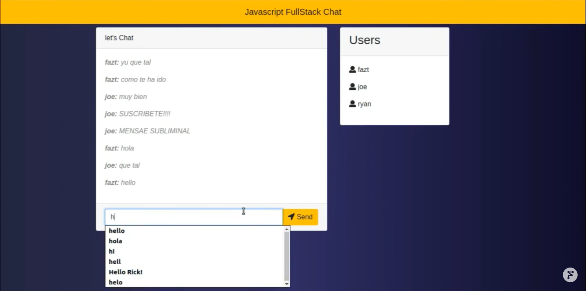

# Chat-JavaScript

## Description

A complete chat application developed with socket.io, Node.js, Express.js and MongoDB. This project use socket.io for the real time chat and MongoDB for the database.

## Screenshots

## Features

-   Real time chat
-   MongoDB database
-   Responsive design
-   Direct messages between users
-   List of connected users

## Technologies

-   [Node.js](https://nodejs.org/en/): A JavaScript runtime built on Chrome's V8 JavaScript engine.
-   [Express.js](https://expressjs.com/): A web application framework for Node.js.
-   [Socket.io](https://socket.io/): A JavaScript library for realtime web applications.
-   [MongoDB](https://www.mongodb.com/): A document-oriented NoSQL database used for high volume data storage.
-   [EJS](https://ejs.co/): A simple templating language that lets you generate HTML markup with plain JavaScript.

## How to use

1. Clone this repository.
2. Install dependencies: `npm install`.
3. Run the server: `npm start`.
4. Open your browser and go to `http://localhost:3000`.
